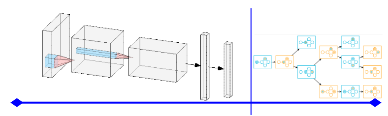
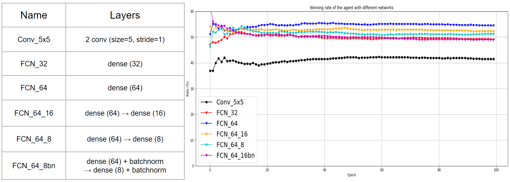

# Reinforcement learning combined with Game theory for PyRat

This is code implementation for the project of PyRat game playing using Deep Q-learning (a Reinforcement learning (RL) algorithm) and Combinatorial game theory as the additional "booster" for the robustness of the RL agent.

- For RL, to speed up the learning process of the agent, a full potential of exploration is provided to it in the beginning of the training via *Epsilon greedy algorithm*. But the exploration capability of the agent exponentially reduces when the number of games it plays increases.


- As the runtime of Combinatorial Game Theory is really long since it needs to compute the best moves by considering the opponent's strategy and position and scanning through the whole maze for the cheese positions, the agent only expoloits game theory onnce the number of the cheese present on the maze is less than 13.



Below is the comparison result on the performance in terms of winrate between different networks used for approximating Q-function.



## 1. Play the game

To play PyRat game you should first go to [this Github repository](https://github.com/BastienPasdeloup/PyRat-1) to get PyRat, and then install some required packages:

```
pip install pygame
pip install gdown
```
You can find all of the information and details about PyRat and its usage in the above Github repository.

After PyRat installation, to use the RL agent with Game theory to beat the Manhattan greedy algorithm, put *TEAM2_AI.py* and *TEAM2_FCN_64_16.pt* to **/AIs** folder in **/Pyrat-1** directory. Then use the **following command** in PyRat-1 directory to launch the game:

```
python pyrat.py -d 0 -md 0 -p 40 -x 21 -y 15 --rat AIs/RL_AI.py --python AIs/manh.py --synchronous --nonsymmetric --nodrawing --tests 1000
```
The winning rate obtained is **82.7%**.

## 2. Train your own agent

To train your RL agent, please refer the /train folder and the python files inside it.
a. Add your new network in rl.py file. I already provide a Fully Connected Network and a Convolutional Network in that file for reference.
b. To change other things relating to the configuration, refer to main.py.
b. To train the network, simply run the following command in PyRat-1 directory:

```
python main.py
```
